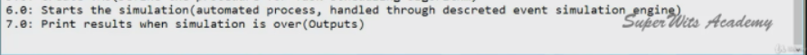
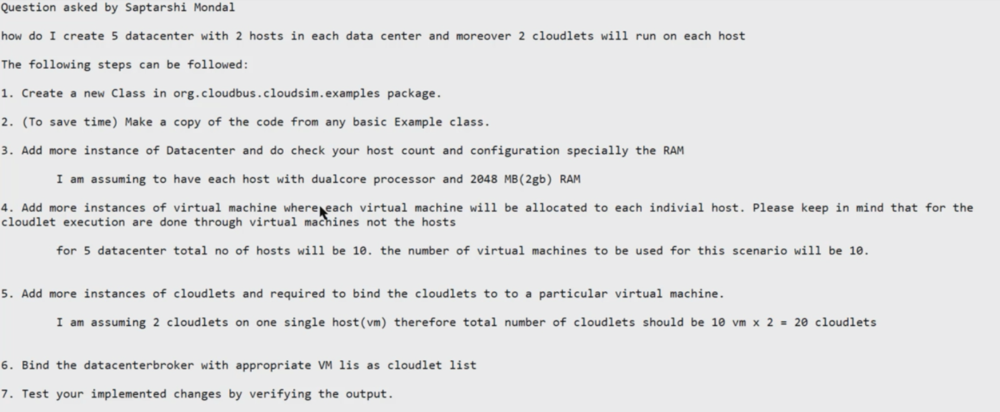

# CloudSim-Exercise
My CloudSim exercise implementation
<!-- TOC -->

- [CloudSim-Exercise](#cloudsim-exercise)
  - [installation](#installation)
- [exercises](#exercises)
  - [CloudSimExercise1](#cloudsimexercise1)
  - [CloudSimExercise2](#cloudsimexercise2)
  - [CloudSimExercise3](#cloudsimexercise3)

<!-- /TOC -->
## installation
- add *.jar dependencies in your local environment

# exercises
## CloudSimExercise1
- 
- 

## CloudSimExercise2
- Shortest Job First (SJF) Task scheduling algorithm implementation in cloudsim
    - see modifications in [DatacenterBrokerSJF.java](./src/DatacenterBrokerSJF.java#L343)

## CloudSimExercise3
- 

